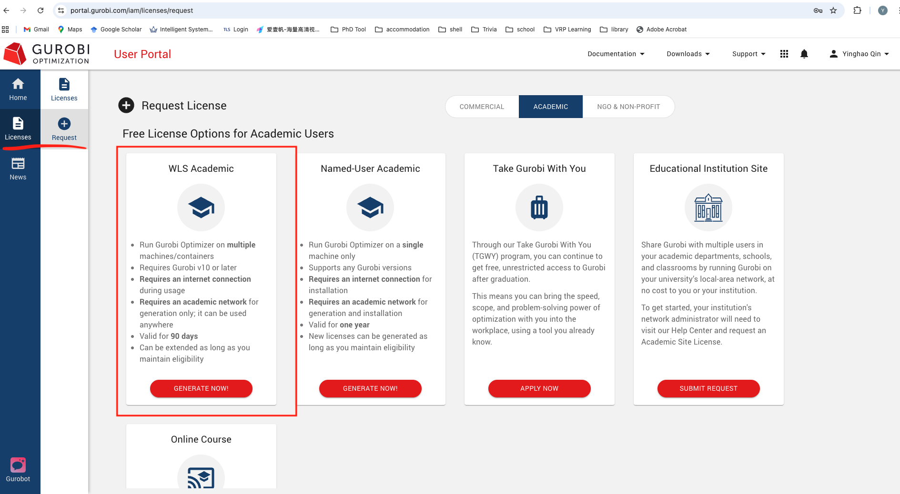

# Gurobi WLS Academic License Application Guide

This guide explains how to apply for a **Gurobi Web License Service (WLS) Academic License** and configure it for use on **Google Colab** or your **local machine**.

- Link: [Official page](https://www.gurobi.com/academia/academic-program-and-licenses/)

  

  

---

## 1. Create a Gurobi Account

1. Go to the [Gurobi Registration Page](https://portal.gurobi.com/iam/register/).

2. Fill in the required information:
   - **Email**: Use your university email address (e.g., `@qmul.ac.uk`).
   - **First Name** / **Last Name**: Enter your full name.
   - ...

3. Click **Register** to create your account.

4. Check your email inbox and click the activation link to verify your account.

   

   

---

## 2. Request a WLS Academic License

1. Log in to the [Gurobi User Portal](https://portal.gurobi.com/).

2. Go to the **Licenses** section.

3. Click **Request Academic License**.

4. In the license request form:
   - Select **Web License Service (WLS)** as the license type.
   - Provide any additional required information.

5. Submit the request.  

   Once approved, your new WLS license will appear in the **Licenses** page.

   

   

   

---

## 3. Download License File

1. Go to the [Web License Manager page](https://license.gurobi.com/manager/licenses/).

2. Open your WLS license entry and download it

   you will get a file named __`gurobi.lic`__.

   

